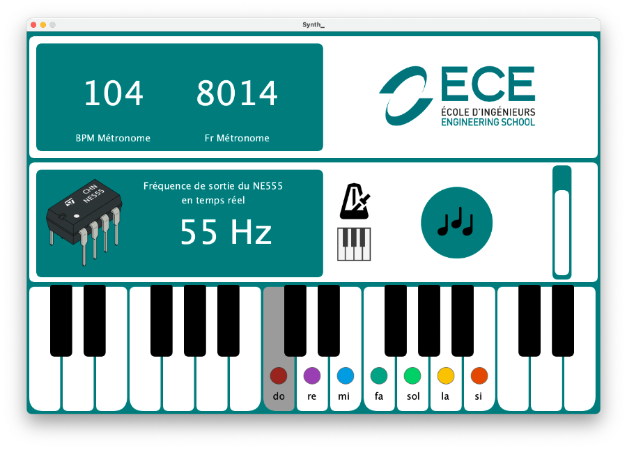
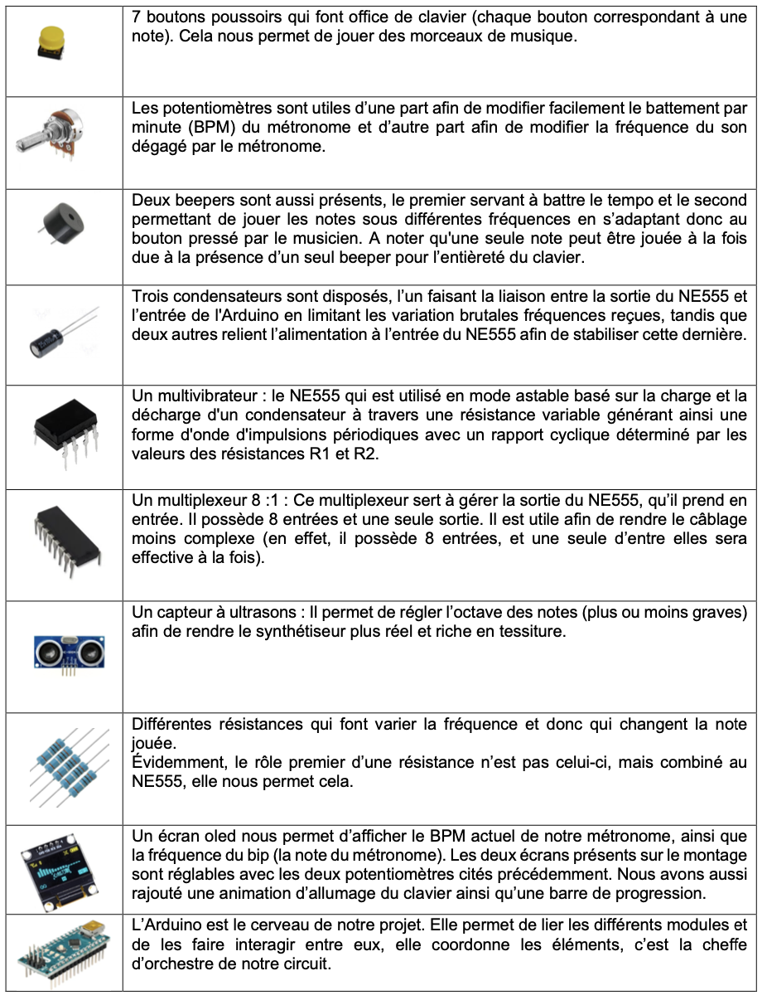

# Synth-ECE 🎹

Comment concevoir et mettre en œuvre un synthétiseur fonctionnel en combinant un kit d'électronique et une interface graphique, afin de réaliser un clip vidéo ?

Dans le cadre du projet semestriel d’électronique, nous devrons concevoir, réaliser et tester un synthétiseur muni d’une interface graphique Processing. Pour cela, nous utiliserons notre kit d’électronique ainsi que notre ordinateur personnel. 

Ensuite, nous devrons réaliser un clip vidéo de 2 minutes mettant en avant notre synthétiseur et notre composition, afin de participer à un concours de créativité.

Vous retrouverez ici notre code arduino ainsi que la partie processing en java. 

En lançant la partie Processing vous devriez arriver sur une interface graphique comme celle-ci si tout fonctionne.  

Attention à ne pas avoir de Serial en action en même temps. 

## Logiciels nécessaires 💻

- [Arduino](https://www.arduino.cc/en/software)
- [Processing](https://processing.org/download)

## Matériel ⚙️

## Branchements ⚡️

Les branchements sont simple. Pour notre projet, nous devions utiliser une NE5555, cependant si vous voulez le réaliser plus simplement, il suffit de faire une lecture de résistance au niveau du clavier pour récupérer le bouton enfoncé.
Pour la thérémine, il suffit d'utiliser une résistance lumineuse ou un capteur ultrason, avec un map sur l'Arduino, il est facile de changer la note. 